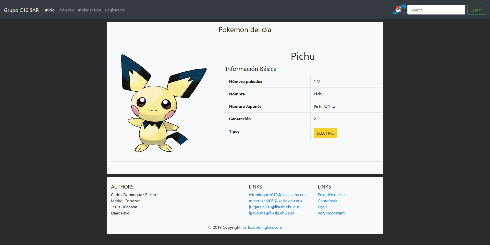
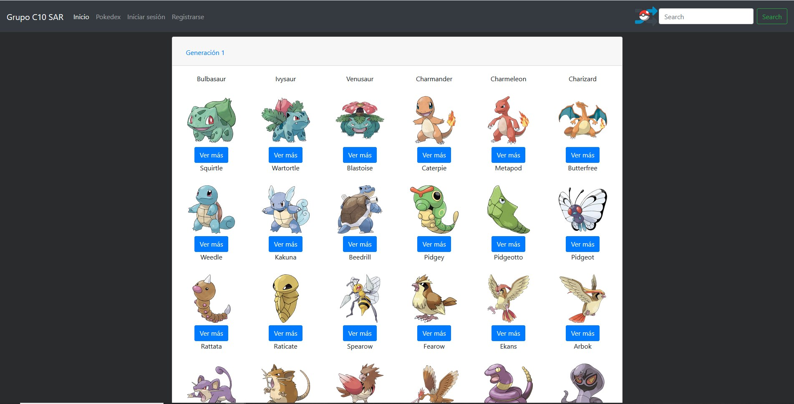
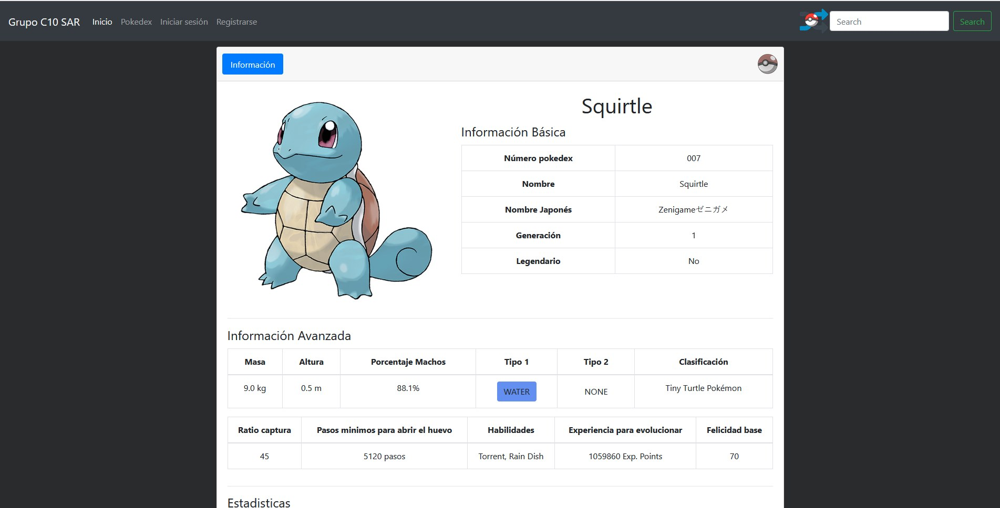

# Pokedex Webpage
 Pokedex webpage written in HTML, CSS, JS, PHP and XML with some python scripts to do web-scrapping and convert data

In order to make it work you need to follow the next steps:

1.Clone the Project  
2.Import to your database the following files (./sql):
  - user.sql
  - favoritos.sql
              
3.Connect to the database (./src/phpscripts/other/Dbconfig.php)
